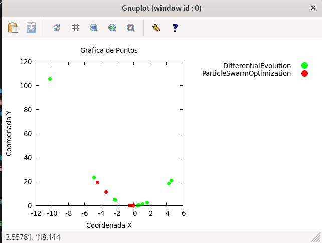

# Aplicación de procesamiento de heurísticas distribuidas 

El siguiente proyecto tiene como objetivo plantear las bases del funcionamiento de una aplicación futura destinada al cálculo distribuido de heurísticas mediante una arquitectura cliente-servidor, cuyos objetivos serán:
- Facilitar la comunicación entre procesos para la distribución de información relevante.
- Permitir llevar a cabo un despliegue distribuido y automatizado.
- Disponer de una gran versatilidad de configuración para las diferentes heurísticas participantes.
- Brindar a los usuarios la posibilidad de colaborar conjuntamente en la búsqueda de los puntos óptimos.


<br />

## Requisitos previos

Para poder utilizar la aplicación, antes de su uso será necesarios realizar los siguientes pasos previos:
- **Instalación de la biblioteca MPI para la de comunicación de procesos distribuidos:** Para la correcta instalación de la biblioteca, se recomienda seguir las instrucciones descritas en el siguiente [enlace](https://lsi2.ugr.es/jmantas/ppr/ayuda/datos/instalaciones/Instalacion_OpenMPI.pdf).
- **Instalación de la herramienta gnuplot para llevar a cabo la correcta proyección de gráficas en con resultados:** Para esto se debe ejecutar el siguiente comando:
    ```BASH
    sudo apt install gnuplot
    ```


<br />

## Arquitectura del proyecto

El proyecto se encuentra organizado en directorios y archivos. Pasamos a describir la funcionalidad de aquellos que consideramos relevantes:
- `src/:` Directorio que contiene el desarrollo del proyecto.
    - `FitnessFunction/:` Directorio que contiene las diferentes clases que definen las posibles funciones de fitness a utilizar por el sistema. Estas deben heredar de la clase `FitnessFunction`.
    - `Heuristic/:` Directorio que contiene las diferentes clases que definen las posibles heurísticas a utilizar por el sistema. Estas deben heredar de la clase `Heuristic`.
    - `Interface/:` Directorio que contiene las clases encargada de interaccionar con los elementos externos de a la aplicación.
        - `FileWriter_interface/:` Contiene la clase encargada de interaccionar con los ficheros de guardado de datos.
        - `Json_interface/:` Contiene la clase encargada de interaccionar con el fichero de configuración y extraer la misma.
- `bin/:` Directorio que contiene los archivos de compilación que ejecutarán el proyecto.
- `docs/:` Directorio que contiene tanto archivos externos importantes para la ejecución del proyecto como documentación relacionada con el mismo:
    - `config.json:` Archivo que contiene la definición de toda la configuración con la que se desarrollará el despliegue y funcionamiento del sistema.
    - `hots:` Archivo que contiene la dirección de aquellos equipos distribuidos que formarán parte del sistema y los núcleos involucrados en el mismo.
- `out/:` Directorio que almacena los datos de salida relevantes tras la ejecución del proyecto.
    - `logFile_*.txt:` Archivo que almacena los datos de salida relevantes tras la ejecución del proyecto.
    - `output.csv:` Archivo que almacena los datos estructurados necesarios para la proyección de gráficas.
- `scripts/:` Directorio que almacena lso scripts para la generación de gráficas mediante gnuplot.


<br />

## Descripción del proyecto


<br />

### 1. Desarrollo del fichero de configuración

El primer paso para poder ejecutar correctamente el proyecto es la definición de un fichero de configuración donde se especifiquen elementos principales como las heurísticas a utilizar, la función de fitness, el número de procesos involucrados, etc.

En el siguiente cuadro podemos ver un fragmente de ejemplo de un fichero de configuración, donde podemos denotar como existen tres elementos principales que engloban todos los parámetros principales:
- **worldConfiguration:** Contiene la configuración relacionada con el mundo en el cual van a operar las heurísticas, es decir, la función de fitness sobre la que se desarrollarán lso cálculos. Esta configuración es global para todos los procesos involucrados y es necesaria para poder llevar a cabo la ejecución de as heurísticas.
- **computerConfiguration:** Contiene la configuración relacionada con los procesos destinados a ejecutar las heurísticas a nivel de nodo, es decir, la configuración compartida por todos aquellos procesos albergados dentro de una misma máquina. Esta configuración identifica las máquinas destino en base a la dirección IP de las mismas y contiene a su vez, un vector con al configuración de todos los nodos que ejecuta internamente.
- **rankConfigurationList:** Vector que contiene la configuración relacionada con los procesos destinado a ejecutar las heurísticas a nivel de proceso. La identificación de la configuración que corresponde a cada proceso se lleva a cabo a través del número de identificación **rank** proporcionado por mpi.

```JSON
{
    "worldConfiguration":{
        "id": "MundoCirculo1",
        "fitnessFunctionID": "Pow2",
        "limitUp": 100,
        "limitDown": -100, 
        "limitRight": 100,
        "limitLeft": -100
    },
    "computerConfiguration": [{
        "IP": "0.0.0.0",
        "logCommonFile":"/home/mario/Documentos/universidad/optimizacion_practicas/trabajoFinal/out/logFile_MundoCirculo1.txt",
        "rankConfigurationList": [{
            "rankList": [0],
            "heuristicID": "ParticleSwarmOptimization",
            "outFIleURL": "/home/mario/Documentos/universidad/optimizacion_practicas/trabajoFinal/out/output.csv",
            "iterations": 500,
            "poblation" : 25,
            "dimensions": 4,
            "valueList":[0.3925, 2.5586, 1.3358]
        },
        {
            "rankList": [1],
            "heuristicID": "DifferentialEvolution",
            "outFIleURL": "/home/mario/Documentos/universidad/optimizacion_practicas/trabajoFinal/out/output.csv",
            "iterations": 500,
            "poblation" : 25,
            "dimensions": 4,
            "valueList":[0.7450, 0.9096]
        },
.
.
.
```


<br />

### 2. Verificación de parámetros y obtención de direcciones IP

Una vez se ha llevado a cabo el desarrollo del fichero de configuración, el proyecto está preparado para ser ejecutado. Para ello disponemos en el fichero `Makefile ` de una macro, por lo que únicamente necesitaremos ejecutar los siguientes comandos:
```BASH
make        //Compilación
make run    //Ejecución
```

el sistema comprueba que los parámetros sean correcto y obtienen las direcciones IP del equipo para poder llevar a cabo la correcta selección de la configuración a implementar. Este paso es desarrollado por el proceso definido como `root`, normalmente el proceso 0.

En los siguientes cuadros podemos ver el fragmento de la función `main` donde se desarrolla esto y la función destinada a obtener las direcciones IP del equipo, respectivamente.

```C
.
.
.
    if(rank == ROOT){
        if(!entryParams_check(argc, argv)){
            cerr << "Error en los parámetros de entrada." << endl;
            flag=false;
        }
        if(!getIPDirections_UNIX(ipv4Addresses, ipv6Addresses, IPv4Ifaces, IPv6Ifaces)) {
            cerr << "Error al obtener direcciones IP." << endl;
            flag=false;
        }

        if(flag){
            Json_interface json_interface = Json_interface(argv[1]);
            jsonConfiguration = json_interface.getJSONConfiguration_FromFile(ipv4Addresses, ipv6Addresses);
            file_commonLog.setFileURL(jsonConfiguration.getComputerConfiguration().getLogCommonFile());

            printStream << "************************************************"; file_commonLog.writeln(printStream, VERBOSE);
            printStream << "EJECUCIÓN DE ALGORITMOS HEURÍSTICOS DISTRIBUIDOS"; file_commonLog.writeln(printStream, VERBOSE);
            printStream << "************************************************"; file_commonLog.writeln(printStream, VERBOSE);
            print_entryParams(argc, argv, file_commonLog, VERBOSE);
            print_IPdirections(ipv4Addresses, ipv6Addresses, IPv4Ifaces, IPv6Ifaces, file_commonLog, VERBOSE);
            printStream << endl << "Fichero de configuración..:" << endl << jsonConfiguration.displayInfo(); file_commonLog.writeln(printStream, VERBOSE);
            printStream << "*************************************************************************" << endl; file_commonLog.writeln(printStream, VERBOSE);
        }
.
.
.
```
```C
bool getIPDirections_UNIX(vector<string>& ipv4Addresses, vector<string>& ipv6Addresses, vector<string>& IPv4Ifaces, vector<string>& IPv6Ifaces){
    struct ifaddrs *ifAddrStruct = nullptr;
    struct ifaddrs *ifa = nullptr;

    if(getifaddrs(&ifAddrStruct) == -1) {
        cerr << "Error al obtener la información de las interfaces de red." << endl;
        return false;
    }

    for(ifa = ifAddrStruct; ifa != nullptr; ifa = ifa->ifa_next) {
        if (ifa->ifa_addr == nullptr) {
            continue;
        }

        void *addr;
        if (ifa->ifa_addr->sa_family == AF_INET) {
            addr = &reinterpret_cast<struct sockaddr_in*>(ifa->ifa_addr)->sin_addr;
            char ipstr[INET_ADDRSTRLEN];
            inet_ntop(AF_INET, addr, ipstr, sizeof(ipstr));
            ipv4Addresses.push_back(ipstr);
            IPv4Ifaces.push_back(string(ifa->ifa_name));
        } else if (ifa->ifa_addr->sa_family == AF_INET6) {
            addr = &reinterpret_cast<struct sockaddr_in6*>(ifa->ifa_addr)->sin6_addr;
            char ipstr[INET6_ADDRSTRLEN];
            inet_ntop(AF_INET6, addr, ipstr, sizeof(ipstr));
            ipv6Addresses.push_back(ipstr);
            IPv6Ifaces.push_back(string(ifa->ifa_name));
        } else {
            continue;
        }
    }
    ipv4Addresses.push_back(IPV4_DEFAULT);
    IPv4Ifaces.push_back("Default");
    ipv6Addresses.push_back(IPV6_DEFAULT);
    IPv6Ifaces.push_back("Default");


    if(ifAddrStruct != nullptr) {
        freeifaddrs(ifAddrStruct);
    }

    return true;
}
```


<br />

### 3. Paso de mensajes de verificación y extracción de la configuración

En el caso de que los parámetros aportados al proyecto sean correctos, el proceso `root` mandará un mensaje de verificación al resto y procesos y todos comenzarán la extracción de la configuración y la selección de aquella que le corresponda. En caso de que no exista una configuración válida, el proceso enviará un mensaje y finalizará su ejecución. previamente a esto, el resto de procesos deberán obtener también sus direcciones IP.

En el siguiente cuadro podemos ver la sección de la función `main` dedicada a realizar dichos pasos:

```C
.
.
.
    if(rank == ROOT){
        for (int dest = 1; dest < size; ++dest) {
            int send_status = MPI_Send(&flag, 1, MPI_CXX_BOOL, dest, 0, MPI_COMM_WORLD);
            if (send_status != MPI_SUCCESS) {
                std::cerr << "Error al enviar datos desde el proceso 0 al proceso " << dest << std::endl;
                MPI_Abort(MPI_COMM_WORLD, 1);
            }
        }

        if(!flag){
            cerr << "FINALIZANDO PROGRAMA" << endl;
            FinalizingExecution(&CommComputer);
        }

    }else{      

        bool flag;
        result = MPI_Recv(&flag, 1, MPI_CXX_BOOL, 0, 0, MPI_COMM_WORLD, MPI_STATUS_IGNORE);
        if (result != MPI_SUCCESS) {
            cerr << "Error al recibir datos en el proceso " << rank << " desde el proceso 0" << endl;
            MPI_Abort(MPI_COMM_WORLD, 1);
            return 1;
        }else if(!flag){
            FinalizingExecution(&CommComputer);
            return 1;            
        }

        if(!getIPDirections_UNIX(ipv4Addresses, ipv6Addresses, IPv4Ifaces, IPv6Ifaces)) {
            cerr << "Error al obtener direcciones IP." << endl;
            cerr << "FINALIZANDO PROGRAMA" << endl;
            FinalizingExecution(&CommComputer);
            return 1;
        }
        Json_interface json_interface = Json_interface(argv[1]);
        jsonConfiguration = json_interface.getJSONConfiguration_FromFile(ipv4Addresses, ipv6Addresses);
        file_commonLog.setFileURL(jsonConfiguration.getComputerConfiguration().getLogCommonFile());
    }

    result = false;
    for(int i=0 ; i<jsonConfiguration.getComputerConfiguration().getRankConfigurationList().size() ; i++){
        if(checkRankInList(jsonConfiguration.getComputerConfiguration().getRankConfiguration_byIndex(i).getRankList(), rank)){
            configRank = jsonConfiguration.getComputerConfiguration().getRankConfiguration_byIndex(i);
            outPutFile.setFileURL(configRank.getOutputFile());
            result = true;
            break;
        }
    }
    if(!result){
        cerr << "No se ha encontrado una configuración válida pra el proceso " << rank << endl;
        cerr << "FINALIZANDO PROGRAMA" << endl;
        FinalizingExecution(&CommComputer);
        return 1;        
    }
.
.
.
```

Por otra parte, la extracción de los parámetros de configuración se llevan a cabo en la se `Json_interface`. A continuación pdoemso ver la función dedicada a al extracción de duchos datos y la creación de la clase donde se almacenarán:

```C
JsonConfiguration Json_interface::getJSONConfiguration_FromFile(vector<string>& ipv4Addresses, vector<string>& ipv6Addresses) {

    JsonConfiguration jsonConfiguration = JsonConfiguration();
     
    ifstream file(getFileURL());
    if (!file.is_open()) {
        cerr << "Error al abrir el archivo JSON (" << getFileURL() << ")"  << endl;
        jsonConfiguration.setStatus(false);
    }

    CharReaderBuilder builder;
    Value root;
    CharReader *reader;
    JSONCPP_STRING errs;
    bool result = true;
    
    //Leemos el fichero JSON
    reader = builder.newCharReader();
    result = parseFromStream(builder, file, &root, &errs);
    if(!result){
        cerr << "Error al parsear el archivo JSON (" << getFileURL() << ")" << endl ;
        cerr << errs << endl;
        jsonConfiguration.setStatus(false);
        return jsonConfiguration;
    }
    file.close();
    
    jsonConfiguration.getWorldConfiguration().setFitnessFunctionID(root["worldConfiguration"]["fitnessFunctionID"].asString());
    jsonConfiguration.getWorldConfiguration().setID(root["worldConfiguration"]["id"].asString());
    jsonConfiguration.getWorldConfiguration().setLimitUp(root["worldConfiguration"]["limitUp"].asDouble());
    jsonConfiguration.getWorldConfiguration().setLimitDown(root["worldConfiguration"]["limitDown"].asDouble());
    jsonConfiguration.getWorldConfiguration().setLimitRight(root["worldConfiguration"]["limitRight"].asDouble());
    jsonConfiguration.getWorldConfiguration().setLimitLeft(root["worldConfiguration"]["limitLeft"].asDouble());
   
    Value computerConfigurationSelected = Value::null;
    for (const auto &computerConfig : root["computerConfiguration"]) {
        if(checkIp(ipv4Addresses, computerConfig["IP"].asString()) || checkIp(ipv6Addresses, computerConfig["IP"].asString())){
            computerConfigurationSelected = computerConfig;
            break;
        }
    }
    if(computerConfigurationSelected == Value::null){
        cerr << "No se encontro ninguna configuración compatible con las direcciones IP del equipo." << endl ;
        jsonConfiguration.setStatus(false);
        return jsonConfiguration;
    }
    jsonConfiguration.getComputerConfiguration().setIP(computerConfigurationSelected["IP"].asString());
    jsonConfiguration.getComputerConfiguration().setLogCommonFile(computerConfigurationSelected["logCommonFile"].asString());

    RankConfiguration rankConfigurationTemp;
    for (const auto &rankConfig : computerConfigurationSelected["rankConfigurationList"]) {
        rankConfigurationTemp = RankConfiguration();
        rankConfigurationTemp.setIsDefault(false);
        rankConfigurationTemp.setOutputFile(rankConfig["outFIleURL"].asString());
        rankConfigurationTemp.setHeuristicID(rankConfig["heuristicID"].asString());
        rankConfigurationTemp.setDimensions(rankConfig["dimensions"].asUInt());
        rankConfigurationTemp.setIterations(rankConfig["iterations"].asUInt());
        rankConfigurationTemp.setPoblation(rankConfig["poblation"].asUInt());

        
        for (const auto &value : rankConfig["rankList"]) {
            rankConfigurationTemp.getRankList().push_back(value.asUInt());
        }
        for (const auto &value : rankConfig["valueList"]) {
            rankConfigurationTemp.getValueList().push_back(value.asFloat());
        }
        jsonConfiguration.getComputerConfiguration().getRankConfigurationList().push_back(rankConfigurationTemp);
    }


    return jsonConfiguration;
}
```


<br />

### 4. Selección de la heurística y la función de fitness a ejecutar

Una vez se ha obtenido correctamente la configuración, los procesos necesitarán seleccionar tanto la función de fitness como la heurística correspondiente a ejecutar. Una vez se ha terminado de ejecutar, el proceso mostrará un mensaje de información y la ejecución finalizará.

En el siguiente cuadro podemos ver la sección de la función `main` dedicada a realizar dichos pasos:

```C
.
.
.
    float (*FitnessFunction)(float);
    FitnessFunction_Pow2 fitnessFunction_Pow2 = FitnessFunction_Pow2();
    if(!jsonConfiguration.getWorldConfiguration().getFitnessFunctionID().compare(fitnessFunction_Pow2.getID())){
        FitnessFunction = FitnessFunction_Pow2::execFunction;
    }

    Heuristic_ArtificialBeeColony heuristic_ArtificialBeeColony = Heuristic_ArtificialBeeColony();
    Heuristic_DifferentialEvolution heuristic_DifferentialEvolution = Heuristic_DifferentialEvolution();
    Heuristic_Fireworks heuristic_Fireworks = Heuristic_Fireworks();
    Heuristic_ParticleSwarmOptimization heuristic_ParticleSwarmOptimization = Heuristic_ParticleSwarmOptimization();
    printStream << "Proceso " << rank << " - Configuración{" << configRank.displayInfo() << "}"; file_commonLog.writeln(printStream, VERBOSE);

    if(!configRank.getHeuristicID().compare(heuristic_ArtificialBeeColony.getID())){
        result = heuristic_ArtificialBeeColony.execHeuristic(FitnessFunction, jsonConfiguration.getWorldConfiguration(), configRank, file_commonLog, outPutFile);

    }else if(!configRank.getHeuristicID().compare(heuristic_DifferentialEvolution.getID())){
        result = heuristic_DifferentialEvolution.execHeuristic(FitnessFunction, jsonConfiguration.getWorldConfiguration(), configRank, file_commonLog, outPutFile);

    }else if(!configRank.getHeuristicID().compare(heuristic_Fireworks.getID())){
        result = heuristic_Fireworks.execHeuristic(FitnessFunction, jsonConfiguration.getWorldConfiguration(), configRank, file_commonLog, outPutFile);

    }else if(!configRank.getHeuristicID().compare(heuristic_ParticleSwarmOptimization.getID())){
        result = heuristic_ParticleSwarmOptimization.execHeuristic(FitnessFunction, jsonConfiguration.getWorldConfiguration(), configRank, file_commonLog, outPutFile);
    }
    printStream << "proceso:" << rank << " - Ejecución finalizada"; file_commonLog.writeln(printStream, VERBOSE);


    FinalizingExecution(&CommComputer);
    return 0;
}
```


<br />

### 5. Ejecución de heurísticas compartiendo hallazgos

En este punto cada uno de los procesos ejecutará la heurística correspondiente, realizando en su proceso, la compartición de los hallazgos de aquellos mínimos que consideren relevantes. Para esto se ha llevado a cabo el desarrollo de funciones específicas tanto de envió como de recepción de los mínimos encontrados.

Estas funciones necesitan ser implementadas de forma específica para cada heurísticas, pues se necesita incluir el proceso de actualización de mínimos, en elc aso de que los recibidos sean atractivos para el proceso receptor. En los siguientes cuadros podemos ver un ejemplo tanto las funciones de de envío como las funciones de recepción de dichos mínimos:

```C
void Heuristic_ParticleSwarmOptimization::checkAndSendMinimun(float posTemp, float oldMin, float newMin, FileWriter_interface file_commonLog, FileWriter_interface file_resultCSV, bool flagVerbose){

    ostringstream printStream;
    int rank, size;
    MPI_Comm_rank(MPI_COMM_WORLD, &rank);
    MPI_Comm_size(MPI_COMM_WORLD, &size); 

    if(newMin < oldMin - (oldMin*SHARED_THRESHOLD_PERCENTAGE)){

        for (int destino = 0; destino < size; ++destino) {
            if (destino != rank) {
                MPI_Send(&posTemp, 1, MPI_FLOAT, destino, 0, MPI_COMM_WORLD);
            }
        }
        printStream << "Proceso: " << rank << " - Nuevo mínimo comparido{ x:" << posTemp << " y:" << oldMin << "}";
        file_commonLog.writeln(printStream, flagVerbose);
        printStream << getID() << SEPARATOR << posTemp << SEPARATOR << newMin;
        file_resultCSV.writeln(printStream, flagVerbose);

    }
    return;
}
```

```C
bool Heuristic_ParticleSwarmOptimization::checkAndReciveMinimun(float *data,  FileWriter_interface file_commonLog, FileWriter_interface file_resultCSV, bool flagVerbose){
    ostringstream printStream;
    MPI_Status statusMessage;
    int rank, size, result, numMessages;
    float receivedData = FLT_MAX;
    MPI_Comm_rank(MPI_COMM_WORLD, &rank);
    MPI_Comm_size(MPI_COMM_WORLD, &size); 

    result = MPI_Iprobe(MPI_ANY_SOURCE, MPI_ANY_TAG, MPI_COMM_WORLD, &numMessages, &statusMessage);
    if(result != MPI_SUCCESS){
        printStream << "Proceso: " << rank << "Error en la comprobación de mensajes pendientes{ fuente: " << statusMessage.MPI_SOURCE << " errorCode:"  << statusMessage.MPI_ERROR << "}" ; file_commonLog.writeln(printStream, flagVerbose);

    }else if(numMessages>0){
        result != MPI_Recv(&receivedData, 1, MPI_FLOAT, MPI_ANY_SOURCE, MPI_ANY_TAG, MPI_COMM_WORLD, &statusMessage);
        if(result != MPI_SUCCESS){
            printStream << "Proceso: " << rank << "Error en la recepción de mensajes{ fuente: " << statusMessage.MPI_SOURCE << " errorCode:"  << statusMessage.MPI_ERROR << "}" ; file_commonLog.writeln(printStream, flagVerbose);
        }else{
            printStream << "Proceso: " << rank << " - Nuevo mínimo recibido{ fuente: " << statusMessage.MPI_SOURCE << " x: " << receivedData << "}"; file_commonLog.writeln(printStream, flagVerbose);
            if(receivedData < *data){
                *data = receivedData;
            }
            return true;
        }
    }
    return false;
}
```


<br />

### 6. Guardado de datos en ficheros de log

Para poder disponer de datos relevantes tras la finalización de una ejecución, los procesos deberán llevar a cabo el guardado de datos en diferentes ficheros:
- **Fichero TXT de log:** Este fichero almacena información relevante sobre la ejecución y es común a todos los procesos que se ejecutan en una misma máquina. La dirección de este fichero es definida mediante la variable `logCommonFile` en el fichero de configuración.
- **Fichero CSV de datos:** Este fichero contiene los datos obtenidos mediante la ejecución de manera estructurada. Son necesarios para la representación de gráficas posteriores y puede ser específicos de cada proceso. La dirección de este fichero es definida mediante la variable `outFIleURL` en el fichero de configuración.

En el siguiente cuadro podemos ver la función dedicada a escribir en los ficheros, la cual consta de un mapeo por cada uno de los ficheros existentes a los cuales se intenta escribir.

```C
bool FileWriter_interface::writeln(ostringstream& data, bool verbose){
    lock_guard<mutex> lock(mutexes[fileURL]);
    ofstream archivo(fileURL, ios::app);

    if (archivo.is_open()) {

        archivo << data.str() << endl;
        if(verbose){
            cout << data.str() << endl;
        }
        data.clear();
        (data.str(std::string()), data.clear());

    } else {
        cerr << "El archivo de escritura no se abrió correctamente." << endl;
        return false;
    }
    return true;
}
```


<br />

### 7. Generación de gráficas

Una vez ha finalizado la ejecución se habrán creado tanto el fichero de log como el fichero de datos. El proyecto aprovecha este segundo para poder generar una gráfica mostrando aquellos puntos relevantes que han sido compartidos por cada uno de las heurísticas. En el fichero `Makefile` disponemos de una macro para la generación de dichas gráficas, por lo que para hacerlo únicamente necesitaremos ejecutar el siguiente comando:
```BASH
make plot
```

A continuación podemos ver tanto un fragmento del fichero de datos como una imagen de la gráfica generada:
```TXT
.
.
.
ParticleSwarmOptimization -4.84641 23.4876
ParticleSwarmOptimization 1.09999 1.20998
ParticleSwarmOptimization -2.3143 5.35597
ParticleSwarmOptimization 4.2954 18.4505
ParticleSwarmOptimization -10.2806 105.691
ParticleSwarmOptimization 1.65268 2.73134
ParticleSwarmOptimization 4.60512 21.2072
ParticleSwarmOptimization 0.697178 0.486057
DifferentialEvolution -4.39594 19.3242
ParticleSwarmOptimization -0.364609 0.13294
ParticleSwarmOptimization -2.20053 4.84234
ParticleSwarmOptimization 0.607964 0.36962
ParticleSwarmOptimization 0.476334 0.226894
DifferentialEvolution -3.37938 11.4202
DifferentialEvolution -0.180534 0.0325927
DifferentialEvolution -0.494612 0.244641
.
.
.
```




<br />

## Aspectos a desarrollar

Los siguientes aspectos a desarrollar no tienen por que seguir un orden específico, pero han sido enumerados para facilitar el inicio de un camino de desarrollo futuro, el cual se entiende factible.


<br />

### 1. Finalización del desarrollo de heurísticas y funciones de fitness

Para llevar a cabo ejecuciones más diversas en un futuro, resulta conveniente finalizar el desarrollo de las heurísticas **Differential Evolution** y **Fireworks**, situadas en los directorios `src/Heuristic/Heuristic_DifferentialEvolution` y `src/Heuristic/Heuristic_Fireworks` respectivamente. Desarrollar una variedad de funciones de fitness con gran diversidad en sus mínimos y en los costes de computo con el objetivo de llevar a cabo ejecuciones más diversas en el futuro.


<br />

### 2. Desarrollo de un modelo principal

Resulta necesario para el correcto funcionamiento del proyecto el buen desarrollo de un modelo de datos completamente independiente de aquellos proporcionados y utilizados por las clases del tipo *interface*, de  modo que estas puedan variar sin afecta e núcleo de funcionamiento del proyecto. Este aspecto trae consigo las siguientes complicaciones:
- Necesidad de desarrollar clases que traduzcan los tipos de datos proporcionados por las interfaces al modelo principal y viceversa.


<br />

### 3. Envío de los parámetros de configuración iniciales desde el proceso principal o servidor

El proceso principal o el proceso servidor deben ser el encargado de obtener los parámetros de configuración, analizar los mismos y enviar a cada proceso que compone el proyecto su configuración correspondiente. Este aspecto trae consigo las siguientes complicaciones:
- Necesidad de creación de un tipo de dato derivado por cada tipo de dato necesario a enviar.


<br />

### 4. Creación de una interfaz dedicada al paso de mensajes MPI

Resulta extremadamente necesario el desarrollo de una clase dedicada a encapsular la funcionalidad del paso de mensajes entre procesos mediante la biblioteca MPI, con el objetivo de poder llevar a cabo un correcto control de la información entre procesos. Esta clase debe estar preparada para interaccionar con el modelo de datos derivado de la clase principal.


<br />

### 5. Desarrollo de un programa servidor dedicado

Llevar a cabo una versión del proyecto dedicada al despliegue del programa servidor con el objetivo de que este pueda permanecer escuchando la posible anexión de nuevos clientes que ejecuten diferentes heurísticas. Esta versión dle programa también puede ser albergada dentro del mismo proyecto, lo cual queda a decisión de desarrollos futuros.

Este aspecto trae consigo las siguientes complicaciones:
- Desarrollo de un demonio ejecutado mediante hilos o procesos hijos que pueda encargarse de la escucha de nuevos mensajes y actuar en consecuencia.
- Adaptación de las direcciones de los nuevos clientes para poder enviar y recibir mensajes de los mismos mediante el uso de la biblioteca MPI.


<br />

### 6. Implementación de relojes para la secuenciación de mensajes

Es necesario la implementación de relojes para controlar correctamente la secuencialización de los mensajes enviados por el conjunto de procesos, con el objetivo de poder mostrar los resultados gráficos con un mayor pulido. Este aspecto trae consigo las siguientes complicaciones:
- Incremento de la dificultad en la transmisión de información mediante el paso de mensajes.


